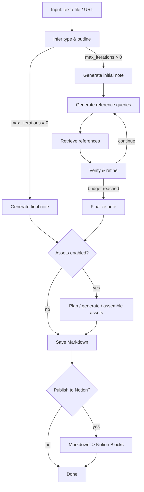
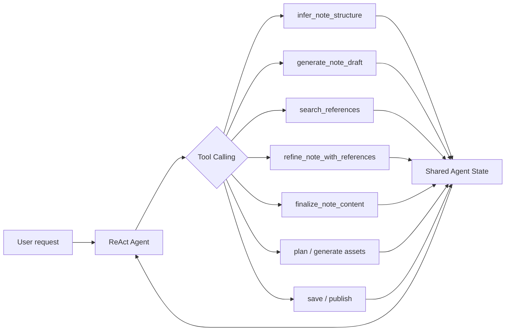

# Note Agent

[](README.md)


**Note Agent** is a LangGraph-based note generation system for research, learning, and technical reading workflows. It organizes input understanding, draft generation, retrieval-based verification, refinement, asset generation, and publishing into an observable workflow, with both a fixed workflow mode and a ReAct tool-calling mode.

- **Fixed Workflow**: Type inference, draft generation, retrieval, verification, refinement, asset generation, saving, and Notion publishing are explicitly orchestrated as LangGraph nodes.
- **ReAct Agent + Tool Calling**: The same capabilities are exposed as tools, and the model selects the next action based on the current run state.
- **Retrieval -> Verification -> Refinement**: The system drafts first, retrieves references, and then refines the note with supporting material to reduce unsupported claims and hallucination risk.
- **Evaluation Harness + LLM-as-Judge**: Prompt snapshots, node-level logic tests, and a 6-dimension judge rubric support measurable iteration on prompts and workflows.

The project is designed for summarizing papers, technical topics, GitHub projects, interview knowledge, and engineering plans. It can also demonstrate practical AI agent design across workflow orchestration, tool calling, evaluation, and production-oriented delivery.

## Demo

> This repository does not currently include a demo GIF or screenshots. Suggested additions:

| Item | Suggested Path | What to Show |
|------|----------------|--------------|
| Web UI screenshot | `docs/screenshots/ui.png` | Input area, run mode, tokens, output canvas |
| Fixed Workflow GIF | `docs/demo-fixed.gif` | Retrieval, verification, and refinement node transitions |
| ReAct Tool Calling GIF | `docs/demo-react.gif` | Agent reasoning, tool calls, and state updates |
| Notion publishing screenshot | `docs/screenshots/notion.png` | Markdown -> Notion Blocks output |

## Core Features

| Capability | Implementation |
|------------|----------------|
| Dual agent architecture | Runtime switch between `fixed` LangGraph Workflow and `react` Tool Calling Agent |
| Multi-source input | Manual text, `.txt` / `.md` files, and webpage URL extraction |
| Retrieval augmentation | DuckDuckGo / Tavily / Perplexity / SearXNG, plus Semantic Scholar / arXiv / OpenAlex / Google Books / Open Library |
| Verification and refinement | Generates patches from retrieved references, applies them to the current note, and saves intermediate versions |
| Streaming output | Streams LLM tokens and updates generated content in the Web UI |
| Token tracking | Records node-level input / output tokens and writes final usage to `runs/{run_id}/final_state.json` |
| Multi-provider support | DeepSeek, OpenAI, Anthropic, Qwen, Moonshot, Zhipu |
| Markdown assets | Formulas, code examples, Mermaid diagrams, chart JSON / PNG, injected into final notes when enabled |
| Notion publishing | Markdown -> Notion Blocks converter with headings, lists, tables, code blocks, inline styles, and LaTeX support |
| Engineering setup | Streamlit UI, CLI, Docker / Compose, pytest tests, Prompt snapshots |

## Agent Architecture

### Fixed Workflow



Fixed Workflow emphasizes stability and control: each node has a clear responsibility, making it suitable for note generation tasks that need a predictable process, observable state, and reproducible output.

### ReAct Agent



In ReAct mode, the same capabilities are exposed as tools, allowing the model to decide whether to retrieve more references, refine the note, generate assets, or publish to Notion based on the current state.

## Fixed Workflow vs ReAct

| Dimension | Fixed Workflow | ReAct Agent |
|-----------|----------------|-------------|
| Control model | Fixed LangGraph nodes and conditional routing | LLM selects tool calls based on state |
| Best fit | Stable batch processing, reproducible pipelines, quality control | Open-ended tasks, dynamic decisions, multi-step exploration |
| Observability | Clear node-level state, event logs, and intermediate versions | Traceable tool-call chain and agent decisions |
| Tradeoff | Lower workflow flexibility | Requires iteration-budget and tool-order constraints |
| Project files | `runner.py` / `graph.py` | `runner_react.py` / `graph_react.py` / `tools.py` |

## Evaluation / Benchmark

The project includes a lightweight Evaluation Harness for assessing prompts and node logic, and for tracking output quality across different iteration settings.

### Evaluation Components

- **Prompt snapshots**: Snapshot outputs for key prompts to catch unintended prompt behavior changes.
- **Node logic tests**: Cover structure parsing, patch application, asset planning, Notion conversion, and other core logic.
- **LLM-as-Judge**: Scores generated notes across 6 dimensions and produces prompt-oriented improvement suggestions.
- **Benchmark runner**: Compares quality across different refinement iteration counts.

### Judge Rubric

| Dimension | Weight | Focus |
|-----------|--------|-------|
| factual_accuracy | 0.25 | Whether facts are accurate and whether hallucinations or fabricated citations appear |
| depth_and_mechanism | 0.20 | Whether mechanisms, reasoning, and causes are explained rather than only listing conclusions |
| completeness | 0.15 | Whether the note covers the key points explicitly requested by the user |
| structure_coherence | 0.15 | Whether the structure is clear and sections are coherent |
| pedagogy_readability | 0.15 | Whether the note is suitable for learning and explains terms and examples clearly |
| asset_appropriateness | 0.10 | Whether formulas, code, and charts are necessary and correct |

### Current Benchmark

> The current sample size is very small and is only useful for validating the evaluation pipeline and observing directional trends. It should not be treated as a generalized conclusion.

The current repository benchmark is `n=1`:

| iterations | overall | factual_accuracy | depth | avg_hallucinations | avg_tokens |
|------------|---------|------------------|-------|--------------------|------------|
| 0 | 4.15 | 3.0 | 4.0 | 1.0 | 20,445 |
| 1 | 4.65 | 4.0 | 5.0 | 0.0 | 33,637 |
| 2 | 4.50 | 4.0 | 5.0 | 1.0 | 74,625 |

For this sample, 1 round of Retrieval -> Verification -> Refinement improved the quality metrics. A second round increased token cost significantly without a stable additional quality gain. Larger samples are needed for stronger conclusions.

## Quick Start

### Requirements

- Python 3.11+
- `uv`
- At least one LLM API key
- Docker optional

### Local Run

```powershell
uv sync
Copy-Item .env.example .env
```

Edit `.env` and configure at least one model provider:

```env
DEEPSEEK_API_KEY=your_deepseek_api_key
DEFAULT_LLM_PROVIDER=deepseek
SEARCH_API=duckduckgo
DEFAULT_MAX_ITERATIONS=1
```

Start the Web UI:

```powershell
uv run streamlit run app.py
```

Open:

```text
http://localhost:8501
```

### CLI

```powershell
uv run note-agent
```

### Optional Dependencies

For chart asset generation and Notion publishing:

```powershell
uv sync --extra assets --extra notion
```

## Docker

```powershell
docker compose up -d --build
```

Open:

```text
http://localhost:8501
```

View logs and stop:

```powershell
docker compose logs -f
docker compose down
```

Persistent directories:

| Host Directory | Container Directory | Contents |
|----------------|---------------------|----------|
| `./notes` | `/app/notes` | Final notes and generated assets |
| `./runs` | `/app/runs` | Run records, event logs, final state |
| `./.cache` | `/app/.cache` | Retrieval cache |

## Configuration

### LLM Providers

| provider | Environment Variable | Default Model |
|----------|----------------------|---------------|
| `deepseek` | `DEEPSEEK_API_KEY` | `deepseek-v4-flash` |
| `openai` | `OPENAI_API_KEY` | `gpt-4o` |
| `anthropic` | `ANTHROPIC_API_KEY` | `claude-sonnet-4-20250514` |
| `qwen` | `DASHSCOPE_API_KEY` | `qwen3.8-max` |
| `moonshot` | `MOONSHOT_API_KEY` | `kimi-k3` |
| `zhipu` | `ZHIPU_API_KEY` | `glm-5.2` |

Optional Qwen configuration:

```env
DASHSCOPE_BASE_URL=https://dashscope.aliyuncs.com/compatible-mode/v1
```

### Retrieval

| search_api | Configuration |
|------------|---------------|
| `duckduckgo` | No key required |
| `tavily` | `TAVILY_API_KEY` |
| `perplexity` | `PERPLEXITY_API_KEY` |
| `searxng` | `SEARXNG_URL` |

Academic and book retrieval is routed internally by source type to Semantic Scholar, arXiv, OpenAlex, Google Books, and Open Library.

### Runtime

```env
DEFAULT_MAX_ITERATIONS=1
MAX_REFERENCE_QUERIES=3
MAX_RESULTS_PER_SOURCE=3
MAX_RETRIEVAL_WORKERS=3
REFERENCE_REQUEST_TIMEOUT=15
LLM_REQUEST_TIMEOUT=180
LLM_STREAM_CHUNK_TIMEOUT=60
```

`DEFAULT_MAX_ITERATIONS=0` skips the retrieval-verification loop and generates the final note directly.

### Notion

```env
NOTION_API_KEY=your_notion_integration_secret
NOTION_PARENT_PAGE_ID=your_notion_parent_page_id
```

Create an Internal Integration in Notion, grant it access to the parent page, and then enable Notion publishing in the Web UI or CLI.

## Project Structure

```text
src/note_agent/
├── agent/        # LangGraph Workflow, ReAct graph, tool calling, prompts, runner
├── assets/       # Formula, code, Mermaid, and chart asset planning/generation
├── config/       # LLM provider and runtime configuration
├── domain/       # request/response/state/schema
├── io/           # Input loading, event stream, storage, Markdown saving
├── notion/       # Markdown -> Notion Blocks conversion and publishing
├── retrieval/    # Multi-source retrieval, cache, result formatting
└── ui/           # Streamlit UI, history, rendering, Token display

tests/
├── unit/         # Unit tests
└── eval/         # Prompt snapshots, LLM-as-Judge, benchmark
```

## Output Directories

| Path | Contents |
|------|----------|
| `notes/` | Final Markdown notes |
| `notes/intermediate/` | Intermediate versions |
| `notes/assets/` | Formulas, code, Mermaid diagrams, charts, and other assets |
| `runs/{run_id}/` | Run summary, event logs, final state, token usage |
| `.cache/references/` | Retrieval cache |

## Tests

The repository does not currently include a GitHub Actions workflow, but it provides local checks suitable for CI integration:

```powershell
uv run pytest tests -q
uv run python -m compileall -q src
uv run ruff check src tests
```

Current local validation record: `256 passed, 22 skipped`.

## Roadmap

- [ ] Add Demo GIFs and Web UI screenshots to improve the GitHub first-screen experience
- [ ] Add GitHub Actions CI for pytest / compileall / ruff
- [ ] Expand benchmark sample size and report quality by note type
- [ ] Add retrieval result reranking / source quality scoring
- [ ] Add export formats: PDF / HTML / Obsidian vault
- [ ] Turn common agent runs into reproducible experiment scripts for engineering demos

## License

This project is licensed under the terms declared in [LICENSE](LICENSE).
