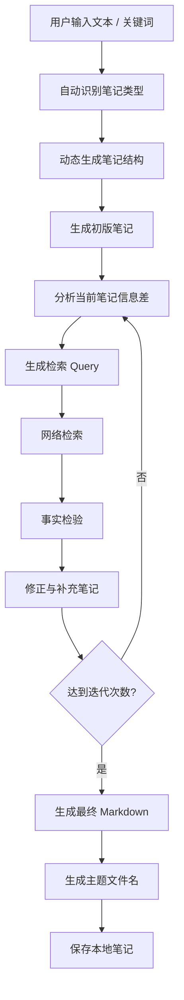

# Note Agent

一个基于 **LangGraph + LangChain + DeepSeek API** 构建的自动研究笔记 Agent。

项目目标不是简单整理文本，而是根据用户输入自动生成研究笔记，通过网络检索补充信息，并在每轮迭代中进行事实校验与内容修正，最终生成结构化 Markdown 笔记。

当前主版本为 **v3.2**，采用 **LangGraph 状态机架构**，支持动态笔记结构、网络检索、事实检验、多轮迭代、多模型选择与多搜索后端扩展。

---

## v3.2 更新内容

v3.2 在 v3.1 的事实检验流程基础上，引入多模型、多搜索后端与前后端解耦架构，并优化检索逻辑，使搜索围绕笔记信息差展开，而非固定模板扩充。

### 多模型支持

支持运行时选择不同 LLM Provider：

- DeepSeek Chat
- OpenAI GPT
- Qwen（通义千问）
- Moonshot（Kimi）
- Zhipu GLM
- SiliconFlow

支持统一模型接口切换，便于后续扩展和前端集成。

---

### 多搜索后端

支持运行时选择不同搜索系统：

- DuckDuckGo
- Tavily
- Perplexity
- SearXNG

支持未来继续扩展自定义搜索引擎。

---

### Query 去重

新增：

- 已使用 Query 状态记录
- 自动去重
- 避免语义重复搜索
- 保证每轮检索具有新的信息增量

---

### 前后端解耦

新增：

- `schemas.py`
- `service.py`
- `config.py`
- `search.py`

后续 Streamlit、FastAPI、React 前端可直接复用核心 Agent。

---

## 功能特点

- 输入文本、关键词或研究主题
- 自动识别笔记类型
- 动态生成笔记结构
- 自动生成初版 Markdown 笔记
- 自动提取知识缺口
- 自动生成检索 Query
- 基于搜索结果进行事实检验
- 对笔记内容与用户输入、网络信息进行一致性检查
- 根据核验结果修正错误与补充遗漏
- 支持多轮迭代
- 支持 Query 去重
- 支持多 LLM Provider
- 支持多搜索后端
- 自动生成体现主题的文件名
- 自动清理 Markdown 代码块包裹
- 自动保存 Markdown 文件
- 支持长期知识积累与个人知识管理
- 支持未来前端扩展

---

## 技术栈

- Python
- LangChain
- LangGraph
- DeepSeek API
- OpenAI Compatible APIs
- DDGS Search
- Tavily
- Perplexity
- SearXNG
- python-dotenv
- Markdown

---

## 项目结构

```text
note-agent/
│
├─ .env
├─ .env.example
├─ .gitignore
├─ requirements.txt
├─ README.md
├─ main.py
│
├─ notes/
│
├─ note_agent/
│  ├─ __init__.py
│  ├─ state.py
│  ├─ schemas.py
│  ├─ config.py
│  ├─ prompts.py
│  ├─ tools.py
│  ├─ search.py
│  ├─ service.py
│  └─ graph.py
│
└─ demos/
   ├─ v1_main.py
   └─ v1_5_main.py
```

---

## 工作流程



---

## 输入示例

输入：

```text
LangChain Agent
DeepSeek API
LangGraph workflow
Memory
RAG

END
```

设置迭代次数：

```text
2
```

Agent 自动执行：

```text
生成初版笔记
→ 判断知识缺口
→ 自动检索
→ 事实检验
→ 修正并更新笔记
→ 第二轮迭代
→ 生成最终 Markdown
→ 保存本地文件
```

输出：

```text
notes/
└── LangChain_Agent学习笔记_20260518_210012.md
```

---

## 安装

创建虚拟环境：

```bash
python -m venv .venv
```

Windows：

```bash
.\.venv\Scripts\activate
```

Git Bash：

```bash
source .venv/Scripts/activate
```

安装依赖：

```bash
pip install -r requirements.txt
```

配置 `.env`：

```env
DEEPSEEK_API_KEY=
OPENAI_API_KEY=
DASHSCOPE_API_KEY=
MOONSHOT_API_KEY=
ZHIPU_API_KEY=
SILICONFLOW_API_KEY=

SEARCH_API=duckduckgo

TAVILY_API_KEY=
PERPLEXITY_API_KEY=
SEARXNG_URL=

DEFAULT_LLM_PROVIDER=deepseek
DEFAULT_MAX_ITERATIONS=2
```

运行：

```bash
python main.py
```

---

## 版本说明

### v3.2（当前版本）

新增：

- 多模型支持
- 多搜索后端
- Query 去重
- 信息差驱动检索
- Service Layer
- Schema 标准化
- 前后端解耦
- `.env.example`
- 搜索配置系统

### v3.1

新增：

- `verify_note`
- 事实检验
- Markdown 清洗
- 自动标题生成
- 文件名优化

### v3.0

新增：

- LangGraph 状态机
- 自动笔记生成
- 动态结构
- 网络检索
- 多轮迭代

---

## Roadmap

### v3.3

- 节点级流式输出
- 运行日志
- 搜索缓存
- 调试面板

### v4

- 本地 RAG
- 向量数据库
- PDF 输入
- Word 输入
- 网页导入
- 长期知识库

### v5

- 多 Agent 协作
- 自动学习规划
- 知识图谱构建
- 可视化前端

---

## Historical Demo Versions

项目早期版本保留为 Demo，用于展示功能演化过程。

### Demo v1

基础笔记整理 Agent：

- 输入原始文本
- 自动生成标题
- 提取核心知识点
- 输出 Markdown
- 自动保存本地笔记

### Demo v1.5

在 v1 基础上增加：

- 支持 `.txt`
- 支持 `.md`
- 文件导入
- 流式输出
- 自动文件命名
- 输入方式选择
- 输入合法性检查

---

## License

MIT