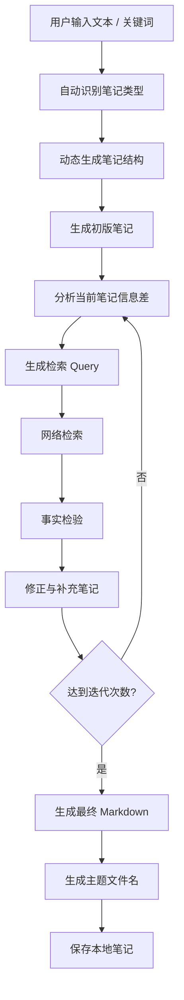

# Note Agent

一个基于 **LangGraph + LangChain + DeepSeek API** 构建的自动研究笔记 Agent。

项目目标不是简单整理文本，而是根据用户输入自动生成研究笔记，通过网络检索补充信息，并在每轮迭代中进行事实校验与内容修正，最终生成结构化 Markdown 笔记。

当前主版本为 **v3.3.0**，采用 **LangGraph 状态机架构**，支持动态笔记结构、网络检索、事实检验、多轮迭代、多模型选择、多搜索后端扩展，以及 Streamlit 可视化交互界面。

---

## v3.3.0 更新内容

v3.3.0 在 v3.2 的多模型、多搜索后端和 service layer 基础上，新增了 **Streamlit 可视化交互界面**，使用户可以通过网页界面运行 Agent，并实时观察状态机运行过程。

### 新增功能

- 新增 `app.py` Streamlit 前端入口
- 支持在网页中输入文本、关键词或研究主题
- 支持在侧边栏选择 LLM Provider
- 支持在侧边栏选择 Search API
- 支持设置最大迭代次数
- 将运行过程拆分为“运行节点”和“当前步骤输出”
- 在输入区域下方展示 LangGraph 运行节点
- 在右侧展示当前节点的逐字流式输出
- 展示检索 Query、搜索过程和 Sources
- 所有长文本内容均放入可滚动文本框，便于阅读和调试
- 支持最终 Markdown 笔记预览
- 保留原有 CLI 入口 `main.py`

---

## 功能特点

- 输入文本、关键词或研究主题
- 自动识别笔记类型
- 动态生成笔记结构
- 自动生成初版 Markdown 笔记
- 自动提取知识缺口
- 自动生成检索 Query
- 基于搜索结果进行事实检验
- 对笔记内容与用户输入、网络信息进行一致性检查
- 根据核验结果修正错误与补充遗漏
- 支持多轮迭代
- 支持 Query 去重
- 支持多 LLM Provider
- 支持多搜索后端
- 支持 Streamlit 可视化交互界面
- 支持运行节点展示
- 支持当前步骤逐字流式输出
- 自动生成体现主题的文件名
- 自动清理 Markdown 代码块包裹
- 自动保存 Markdown 文件
- 支持长期知识积累与个人知识管理
- 支持未来前端扩展

---

## 技术栈

- Python
- LangChain
- LangGraph
- DeepSeek API
- OpenAI Compatible APIs
- DDGS Search
- Tavily
- Perplexity
- SearXNG
- Streamlit
- python-dotenv
- Markdown

---

## 项目结构

```text
note-agent/
│
├─ .env
├─ .env.example
├─ .gitignore
├─ requirements.txt
├─ README.md
├─ main.py
├─ app.py
│
├─ notes/
│
├─ note_agent/
│  ├─ __init__.py
│  ├─ state.py
│  ├─ schemas.py
│  ├─ config.py
│  ├─ prompts.py
│  ├─ tools.py
│  ├─ search.py
│  ├─ service.py
│  └─ graph.py
│
└─ demos/
   ├─ v1_main.py
   └─ v1_5_main.py
```

---

## 工作流程



---

## Streamlit 可视化界面

v3.3.0 新增网页交互界面，用于替代纯命令行操作。

界面主要包括：

```text
左侧 Sidebar：
- LLM Provider 选择
- Search API 选择
- 最大迭代次数设置
- 当前功能说明

主页面左侧：
- 输入文本 / 关键词
- 运行节点展示

主页面右侧：
- 当前步骤逐字输出
- 检索 Query / 搜索过程
- Sources

底部：
- 最终 Markdown 笔记预览
```

运行方式：

```bash
streamlit run app.py
```

启动后浏览器会打开：

```text
http://localhost:8501
```

---

## 安装

创建虚拟环境：

```bash
python -m venv .venv
```

Windows：

```bash
.\.venv\Scripts\activate
```

Git Bash：

```bash
source .venv/Scripts/activate
```

安装依赖：

```bash
pip install -r requirements.txt
```

配置 `.env`：

```env
DEEPSEEK_API_KEY=
OPENAI_API_KEY=
DASHSCOPE_API_KEY=
MOONSHOT_API_KEY=
ZHIPU_API_KEY=
SILICONFLOW_API_KEY=

SEARCH_API=duckduckgo

TAVILY_API_KEY=
PERPLEXITY_API_KEY=
SEARXNG_URL=

DEFAULT_LLM_PROVIDER=deepseek
DEFAULT_MAX_ITERATIONS=2
```

---

## 运行方式

### 命令行运行

```bash
python main.py
```

### 可视化界面运行

```bash
streamlit run app.py
```

---

## 版本说明

### v3.3.0（当前版本）

新增：

- Streamlit 可视化界面
- 运行节点展示
- 当前步骤逐字流式输出
- 检索 Query / 搜索过程展示
- Sources 展示
- 最终 Markdown 预览
- 可滚动文本框 UI
- 保留 CLI 与 service layer 复用能力

### v3.2

新增：

- 多模型支持
- 多搜索后端
- Query 去重
- 信息差驱动检索
- Service Layer
- Schema 标准化
- 前后端解耦
- `.env.example`
- 搜索配置系统

### v3.1

新增：

- `verify_note`
- 事实检验
- Markdown 清洗
- 自动标题生成
- 文件名优化

### v3.0

新增：

- LangGraph 状态机
- 自动笔记生成
- 动态结构
- 网络检索
- 多轮迭代

---

## Roadmap

### v3.4

- 运行日志持久化
- 节点耗时统计
- 搜索缓存
- 中间版本笔记保存
- 调试面板增强

### v4

- 本地 RAG
- 向量数据库
- PDF 输入
- Word 输入
- 网页导入
- 长期知识库

### v5

- 多 Agent 协作   
- 自动学习规划
- 知识图谱构建
- 更完整的前端应用

---

## Historical Demo Versions

项目早期版本保留为 Demo，用于展示功能演化过程。

### Demo v1

基础笔记整理 Agent：

- 输入原始文本
- 自动生成标题
- 提取核心知识点
- 输出 Markdown
- 自动保存本地笔记

### Demo v1.5

在 v1 基础上增加：

- 支持 `.txt`
- 支持 `.md`
- 文件导入
- 流式输出
- 自动文件命名
- 输入方式选择
- 输入合法性检查

---

## License

MIT