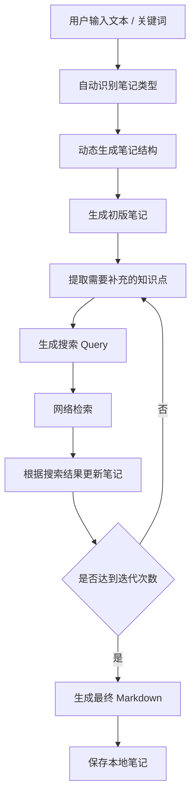

# Note Agent

一个基于 **LangGraph + LangChain + DeepSeek API** 构建的自动研究笔记 Agent。

项目目标不是简单整理文本，而是根据用户输入自动生成研究笔记，通过网络检索不断补充信息，并进行多轮迭代，最终生成结构化 Markdown 笔记。

当前主版本为 **v3.0**，采用 **LangGraph 状态机架构**，参考 Research Agent 工作流实现自动笔记生成与知识补充。

---

## 功能特点

- 输入文本、关键词或研究主题
- 自动识别笔记类型
- 动态生成笔记结构
- 自动生成初版 Markdown 笔记
- 自动提取知识补充需求
- 自动生成网络检索问题
- 基于搜索结果进行多轮笔记迭代
- 支持设置迭代次数
- 自动保存 Markdown 文件
- 支持长期知识积累与个人知识管理

---

## 技术栈

- Python
- LangChain
- LangGraph
- DeepSeek API
- DDGS Search
- python-dotenv
- Markdown
---

## 项目结构

```text
note-agent/
│
├─ .env
├─ .gitignore
├─ requirements.txt
├─ README.md
├─ main.py
│
├─ notes/
│
├─ note_agent/
│  ├─ __init__.py
│  ├─ state.py
│  ├─ prompts.py
│  ├─ tools.py
│  └─ graph.py
│
└─ demos/
   ├─ v1_main.py
   └─ v1_5_main.py
```

---


## 工作流程



---

## 输入示例

输入：

```text
LangChain Agent
DeepSeek API
LangGraph workflow
Memory
RAG

END
```

设置迭代次数：

```text
2
```

Agent 自动执行：

```text
生成初版笔记
→ 自动提取知识缺口
→ 自动检索
→ 更新笔记
→ 第二轮迭代
→ 保存 Markdown
```

输出：

```text
notes/
└── 技术学习笔记_20260518_210012.md
```

---

## 安装

创建虚拟环境：

```bash
python -m venv .venv
```

Windows：

```bash
.\.venv\Scripts\activate
```

安装依赖：

```bash
pip install -r requirements.txt
```

配置 `.env`：

```env
DEEPSEEK_API_KEY=your_api_key
```

运行：

```bash
python main.py
```

---

## Roadmap

### v3.1

- 增加事实校验节点
- 搜索结果与笔记内容比对
- 自动纠正遗漏内容

### v3.2

- 增加节点流式输出
- 增加运行日志
- 增加可视化调试

### v4

- 本地 RAG
- 向量数据库
- PDF 输入
- 网页导入
- 长期知识库

### v5

- 多 Agent 协作
- 自动学习规划
- 知识图谱构建

---

## Historical Demo Versions

项目早期版本保留为 Demo，用于展示功能演化过程。

---

### Demo v1

基础笔记整理 Agent。

功能：

- 输入原始文本
- 自动生成标题
- 提取核心知识点
- 输出 Markdown
- 自动保存本地笔记

流程：

```text
输入文本
→ 内容分析
→ Markdown 生成
→ 保存文件
```

---

### Demo v1.5

在 v1 基础上增加：

- 支持 `.txt`
- 支持 `.md`
- 文件导入
- 流式输出
- 自动文件命名
- 输入方式选择
- 输入合法性检查

---

## License

MIT