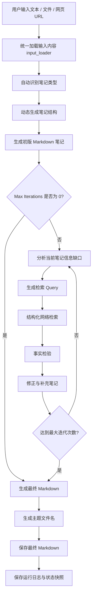

# Note Agent

一个基于 **LangGraph + LangChain + DeepSeek API / OpenAI Compatible APIs** 构建的自动研究笔记 Agent。

项目目标不是简单整理文本，而是根据用户输入自动生成研究笔记，通过网络检索补充信息，并在多轮迭代中进行事实校验、内容修正和结构优化，最终生成结构化 Markdown 笔记。

当前主版本为 **v3.4.0**，采用 **LangGraph 状态机架构**，支持多输入源、动态笔记结构、结构化网络检索、事实检验、多轮迭代、多模型选择、多搜索后端扩展、搜索缓存、运行日志持久化、中间版本保存，以及 Streamlit 可视化交互界面。

---

## v3.4.0 更新内容

v3.4.0 在 v3.3.0 的 Streamlit 可视化界面和 Agent 状态机基础上，重点增强了 **可观测性、可复盘性和证据结构化能力**。

本版本的核心目标是：

> 让 Agent 的每一步运行过程都可以追踪，让每轮生成结果都可以回溯，让搜索结果从纯文本升级为结构化证据。

### 新增功能

- 支持多输入源：
  - 手动文本输入
  - 本地 `.txt` / `.md` 文件导入
  - 网页 URL 内容导入
- 新增 `input_loader.py`
  - 统一处理手动输入、文件输入和网页输入
  - 将不同来源内容整合为统一 Agent 输入
- 新增结构化搜索结果 `SearchResultItem`
  - `query`
  - `title`
  - `snippet`
  - `url`
  - `search_api`
  - `retrieved_at`
- 搜索结果不再只是拼接文本，而是作为结构化证据参与事实核验
- 新增搜索缓存：
  - 默认保存在 `.cache/search/`
  - 相同 `query + search_api + max_results` 不重复请求
- 新增运行日志持久化：
  - 每次运行生成独立 `run_id`
  - 运行记录保存在 `runs/{run_id}/`
  - 保存运行摘要、事件日志和最终状态快照
- 新增中间版本笔记保存：
  - 初版笔记
  - 每轮修正后的笔记
  - 最终整理版本
- `Max Iterations` 支持设置为 `0`
  - `0` 表示跳过检索、核验和修正，直接生成最终 Markdown
- Streamlit UI 增强：
  - 支持文件上传
  - 支持网页 URL 输入
  - 展示运行 ID
  - 展示运行日志目录
  - 展示中间版本路径
  - 展示 Sources
- 保留原有 CLI 入口 `main.py`
- 保留原有 Service Layer，方便后续接入 FastAPI、React 前端或桌面端

---

## 功能特点

- 支持输入文本、关键词、研究主题
- 支持导入 `.txt` / `.md` 文件
- 支持导入网页 URL
- 自动识别笔记类型
- 动态生成笔记结构
- 自动生成初版 Markdown 笔记
- 自动提取当前笔记的信息缺口
- 自动生成检索 Query
- 支持 Query 去重
- 支持结构化网络检索
- 支持搜索缓存
- 支持事实检验
- 支持基于搜索证据修正笔记
- 支持多轮迭代
- 支持中间版本保存
- 支持运行日志持久化
- 支持多 LLM Provider
- 支持多搜索后端
- 支持 Streamlit 可视化交互界面
- 支持 LangGraph 运行节点展示
- 支持当前步骤逐字流式输出
- 自动生成体现主题的文件名
- 自动清理 Markdown 代码块包裹
- 自动保存 Markdown 文件
- 支持长期知识积累与个人知识管理
- 支持未来扩展为完整个人知识 Agent

---

## 技术栈

- Python
- LangChain
- LangGraph
- DeepSeek API
- OpenAI Compatible APIs
- DDGS Search
- Tavily
- Perplexity
- SearXNG
- Streamlit
- Pydantic
- Requests
- BeautifulSoup4
- python-dotenv
- Markdown

---

## 项目结构

```text
note-agent/
│
├─ .env
├─ .env.example
├─ .gitignore
├─ requirements.txt
├─ README.md
├─ main.py
├─ app.py
│
├─ notes/
│  └─ intermediate/
│
├─ runs/
│
├─ .cache/
│  └─ search/
│
├─ note_agent/
│  ├─ __init__.py
│  ├─ state.py
│  ├─ schemas.py
│  ├─ models.py
│  ├─ storage.py
│  ├─ config.py
│  ├─ prompts.py
│  ├─ tools.py
│  ├─ search.py
│  ├─ input_loader.py
│  ├─ service.py
│  └─ graph.py
│
└─ demos/
   ├─ v1_main.py
   └─ v1_5_main.py
```

---

## 工作流程



---

## Streamlit 可视化界面

界面主要包括：

```text
左侧 Sidebar：
- LLM Provider 选择
- Search API 选择
- Max Iterations 设置
- 当前功能说明

主页面左侧：
- 手动文本输入
- .txt / .md 文件上传
- 网页 URL 输入
- 运行节点展示

主页面右侧：
- 当前步骤逐字输出
- 检索 Query / 搜索过程 / 中间版本信息
- Sources

底部：
- 最终 Markdown 笔记预览
- 保存路径
- 运行 ID
- 运行日志目录
- 中间版本路径
```

运行方式：

```bash
streamlit run app.py
```

启动后浏览器会打开：

```text
http://localhost:8501
```

---

## 安装

创建虚拟环境：

```bash
python -m venv .venv
```

Windows：

```bash
.\.venv\Scripts\activate
```

Git Bash：

```bash
source .venv/Scripts/activate
```

安装依赖：

```bash
pip install -r requirements.txt
```

配置 `.env`：

```env
DEEPSEEK_API_KEY=
OPENAI_API_KEY=
DASHSCOPE_API_KEY=
MOONSHOT_API_KEY=
ZHIPU_API_KEY=
SILICONFLOW_API_KEY=

SEARCH_API=duckduckgo

TAVILY_API_KEY=
PERPLEXITY_API_KEY=
SEARXNG_URL=

DEFAULT_LLM_PROVIDER=deepseek
DEFAULT_MAX_ITERATIONS=2
```

---

## 运行方式

### 命令行运行

```bash
python main.py
```

### 可视化界面运行

```bash
streamlit run app.py
```

---

## 版本说明

### v3.4.0（当前版本）

新增：

- 多输入源支持
- nput_loader.py
- 结构化搜索结果 SearchResultItem
- 搜索缓存 .cache/search/
- 运行日志持久化 runs/{run_id}/
- 中间版本笔记保存 notes/intermediate/{run_id}/
- 运行 ID
- 最终状态快照
- Streamlit 文件上传
- Streamlit 网页 URL 输入
- Max Iterations 支持 0
- Service Layer 接入运行日志
- 搜索结果作为结构化证据参与事实核验

### v3.3.0

新增：

- Streamlit 可视化界面
- 运行节点展示
- 当前步骤逐字流式输出
- 检索 Query / 搜索过程展示
- Sources 展示
- 最终 Markdown 预览
- 可滚动文本框 UI
- 保留 CLI 与 service layer 复用能力

### v3.2.0

新增：

- 多模型支持
- 多搜索后端
- Query 去重
- 信息差驱动检索
- Service Layer
- Schema 标准化
- 前后端解耦
- `.env.example`
- 搜索配置系统

### v3.1.0

新增：

- `verify_note`
- 事实检验
- Markdown 清洗
- 自动标题生成
- 文件名优化

### v3.0.0

新增：

- LangGraph 状态机
- 自动笔记生成
- 动态结构
- 网络检索
- 多轮迭代

---

## Roadmap

### v3.4

- 运行日志持久化
- 节点耗时统计
- 搜索缓存
- 中间版本笔记保存
- 调试面板增强

### v4

- 本地 RAG
- 向量数据库
- PDF 输入
- Word 输入
- 网页导入
- 长期知识库

### v5

- 多 Agent 协作
- 自动学习规划
- 项目知识库
- 知识图谱构建
- 更完整的前端应用
- 个人 Agent 助手化
- 任务管理与提醒
- 多项目上下文隔离

---

## Historical Demo Versions

项目早期版本保留为 Demo，用于展示功能演化过程。

### Demo v1

基础笔记整理 Agent：

- 输入原始文本
- 自动生成标题
- 提取核心知识点
- 输出 Markdown
- 自动保存本地笔记

### Demo v1.5

在 v1 基础上增加：

- 支持 `.txt`
- 支持 `.md`
- 文件导入
- 流式输出
- 自动文件命名
- 输入方式选择
- 输入合法性检查

---

## License

MIT