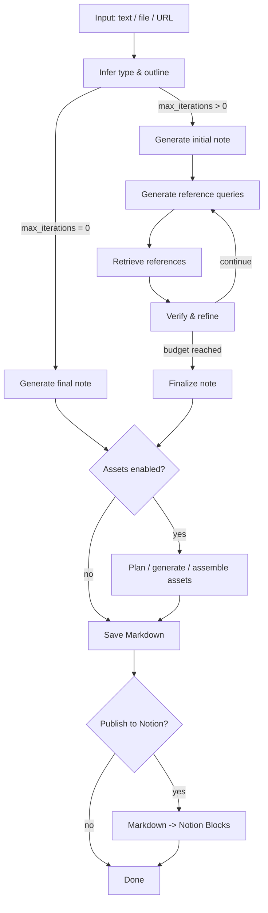
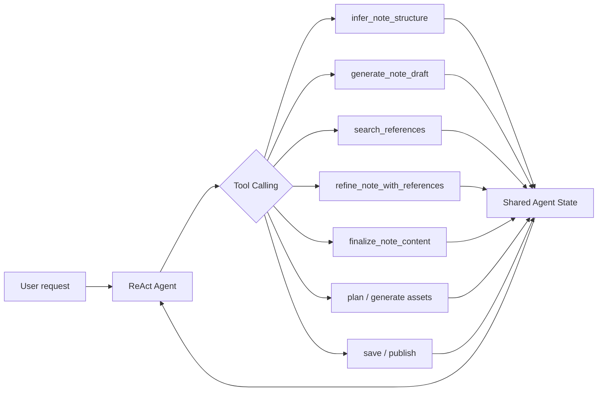

# Note Agent


一个面向研究、学习和技术阅读的 **LangGraph Note Agent**。它不是把用户输入直接丢给 LLM 的普通 Demo，而是把笔记生成拆成可观测、可迭代、可评估的 Agent 流程：

- **Fixed Workflow**：类型识别、初稿生成、检索、核验、修正、资产生成、保存 / Notion 发布由 LangGraph 节点显式编排。
- **ReAct Agent + Tool Calling**：同一组能力封装为工具，由模型在运行时决定下一步调用什么。
- **Retrieval -> Verification -> Refinement**：先生成，再检索证据，再用参考资料修正笔记，降低无来源断言和幻觉风险。
- **Evaluation Harness + LLM-as-Judge**：用快照测试、节点逻辑测试和 6 维 Judge 评分体系支持 Prompt / Workflow 的量化迭代。

适合用来整理论文、技术主题、GitHub 项目、面试知识点和工程方案，也适合作为展示 **AI Agent 架构设计、工具调用、评估体系和工程化落地能力** 的作品集项目。

## Demo

> 当前仓库还没有提交 Demo GIF 或截图。建议后续补充：

| 内容 | 建议位置 | 展示重点 |
|------|----------|----------|
| Web UI 运行截图 | `docs/screenshots/ui.png` | 输入区、运行模式、Token、输出画布 |
| Fixed Workflow 动图 | `docs/demo-fixed.gif` | 检索、核验、修正节点流转 |
| ReAct Tool Calling 动图 | `docs/demo-react.gif` | Agent 思考、工具调用、状态更新 |
| Notion 发布截图 | `docs/screenshots/notion.png` | Markdown -> Notion Blocks 效果 |

## 核心功能

| 能力 | 实现 |
|------|------|
| 双 Agent 架构 | `fixed` LangGraph Workflow 与 `react` Tool Calling Agent，可运行时切换 |
| 多源输入 | 手动文本、`.txt` / `.md` 文件、网页 URL 正文抓取 |
| 检索增强 | DuckDuckGo / Tavily / Perplexity / SearXNG，以及 Semantic Scholar / arXiv / OpenAlex / Google Books / Open Library |
| 核验修正 | 根据检索结果生成 patch，应用到当前笔记并保存中间版本 |
| Streaming 输出 | LLM token 流式输出，Web UI 实时刷新生成内容 |
| Token Tracking | 按节点记录输入 / 输出 token，最终写入 `runs/{run_id}/final_state.json` |
| 多模型适配 | DeepSeek、OpenAI、Anthropic、Qwen、Moonshot、Zhipu |
| Markdown 资产 | 公式、代码示例、Mermaid 图、图表 JSON / PNG，可注入最终笔记 |
| Notion 发布 | 自研 Markdown -> Notion Blocks 转换器，支持标题、列表、表格、代码块、行内样式和 LaTeX |
| 工程化 | Streamlit UI、CLI、Docker / Compose、pytest 测试、Prompt snapshots |

## Agent 架构

### Fixed Workflow


```mermaid
flowchart TD
    A[Input: text / file / URL] --> B[Infer type & outline]
    B -->|max_iterations = 0| C[Generate final note]
    B -->|max_iterations > 0| D[Generate initial note]
    D --> E[Generate reference queries]
    E --> F[Retrieve references]
    F --> G[Verify & refine]
    G -->|continue| E
    G -->|budget reached| H[Finalize note]
    C --> I{Assets enabled?}
    H --> I
    I -->|yes| J[Plan / generate / assemble assets]
    I -->|no| K[Save Markdown]
    J --> K
    K --> L{Publish to Notion?}
    L -->|yes| M[Markdown -> Notion Blocks]
    L -->|no| N[Done]
    M --> N
```

Fixed Workflow 的重点是可控：每个节点职责明确，适合需要稳定流程、可观测状态和可复现输出的笔记生成任务。

### ReAct Agent


```mermaid
flowchart LR
    U[User request] --> A[ReAct Agent]
    A --> T{Tool Calling}
    T --> T1[infer_note_structure]
    T --> T2[generate_note_draft]
    T --> T3[search_references]
    T --> T4[refine_note_with_references]
    T --> T5[finalize_note_content]
    T --> T6[plan / generate assets]
    T --> T7[save / publish]
    T1 --> S[Shared Agent State]
    T2 --> S
    T3 --> S
    T4 --> S
    T5 --> S
    T6 --> S
    T7 --> S
    S --> A
```

ReAct 模式把同一套能力暴露为工具，模型可以根据当前状态自主决定是否继续检索、是否修正、是否生成资产或发布到 Notion。

## Fixed Workflow vs ReAct

| 维度 | Fixed Workflow | ReAct Agent |
|------|----------------|-------------|
| 控制方式 | LangGraph 节点和条件路由固定编排 | LLM 根据状态选择工具调用 |
| 适合场景 | 稳定批处理、可复现流水线、质量控制 | 开放式任务、动态决策、多步骤探索 |
| 可观测性 | 节点级状态、事件日志、中间版本清晰 | 工具调用链和 Agent 决策过程可追踪 |
| 风险 | 流程灵活性较低 | 需要约束迭代预算和工具调用顺序 |
| 本项目处理 | `runner.py` / `graph.py` | `runner_react.py` / `graph_react.py` / `tools.py` |

## Evaluation / Benchmark

项目包含一个轻量 Evaluation Harness，用来评估 Prompt 与节点逻辑，而不是只看单次 Demo 输出。

### 评估组成

- **Prompt snapshots**：固定关键 Prompt 的输出快照，避免无意改坏生成策略。
- **Node logic tests**：覆盖结构解析、patch 应用、资产规划、Notion 转换等核心逻辑。
- **LLM-as-Judge**：按 6 个维度对生成笔记评分，并输出面向 Prompt 的改进建议。
- **Benchmark runner**：比较不同迭代轮数下的质量变化。

### Judge Rubric

| 维度 | 权重 | 关注点 |
|------|------|--------|
| factual_accuracy | 0.25 | 事实是否准确，是否存在幻觉或编造引用 |
| depth_and_mechanism | 0.20 | 是否解释机制、推导和原因，而不是只罗列结论 |
| completeness | 0.15 | 是否覆盖用户明确要求的关键点 |
| structure_coherence | 0.15 | 结构是否清晰，章节是否连贯 |
| pedagogy_readability | 0.15 | 是否适合学习，术语和例子是否清楚 |
| asset_appropriateness | 0.10 | 公式 / 代码 / 图表是否必要且正确 |

### 当前 Benchmark

> 样本量很小，仅用于验证评估链路和观察趋势，不能作为泛化结论。

当前仓库记录的 benchmark 为 `n=1`：

| iterations | overall | factual_accuracy | depth | avg_hallucinations | avg_tokens |
|------------|---------|------------------|-------|--------------------|------------|
| 0 | 4.15 | 3.0 | 4.0 | 1.0 | 20,445 |
| 1 | 4.65 | 4.0 | 5.0 | 0.0 | 33,637 |
| 2 | 4.50 | 4.0 | 5.0 | 1.0 | 74,625 |

可见 1 轮 Retrieval -> Verification -> Refinement 在该样本上带来了提升；2 轮成本显著上升，质量没有继续稳定提升。更可靠的结论需要扩大样本量。

## 快速开始

### 环境要求

- Python 3.11+
- `uv`
- 至少一个 LLM API Key
- Docker 可选

### 本地运行

```powershell
uv sync
Copy-Item .env.example .env
```

编辑 `.env`，至少配置一个模型供应商：

```env
DEEPSEEK_API_KEY=your_deepseek_api_key
DEFAULT_LLM_PROVIDER=deepseek
SEARCH_API=duckduckgo
DEFAULT_MAX_ITERATIONS=1
```

启动 Web UI：

```powershell
uv run streamlit run app.py
```

打开：

```text
http://localhost:8501
```

### CLI

```powershell
uv run note-agent
```

### 可选依赖

如需图表资产生成和 Notion 发布：

```powershell
uv sync --extra assets --extra notion
```

## Docker

```powershell
docker compose up -d --build
```

访问：

```text
http://localhost:8501
```

查看日志和停止：

```powershell
docker compose logs -f
docker compose down
```

持久化目录：

| 宿主机目录 | 容器目录 | 内容 |
|------------|----------|------|
| `./notes` | `/app/notes` | 最终笔记和生成资产 |
| `./runs` | `/app/runs` | 运行记录、事件日志、最终状态 |
| `./.cache` | `/app/.cache` | 检索缓存 |

## 配置

### LLM Providers

| provider | 环境变量 | 默认模型 |
|----------|----------|----------|
| `deepseek` | `DEEPSEEK_API_KEY` | `deepseek-v4-flash` |
| `openai` | `OPENAI_API_KEY` | `gpt-4o` |
| `anthropic` | `ANTHROPIC_API_KEY` | `claude-sonnet-4-20250514` |
| `qwen` | `DASHSCOPE_API_KEY` | `qwen3.8-max` |
| `moonshot` | `MOONSHOT_API_KEY` | `kimi-k3` |
| `zhipu` | `ZHIPU_API_KEY` | `glm-5.2` |

Qwen 可选配置：

```env
DASHSCOPE_BASE_URL=https://dashscope.aliyuncs.com/compatible-mode/v1
```

### Retrieval

| search_api | 配置 |
|------------|------|
| `duckduckgo` | 无需 Key |
| `tavily` | `TAVILY_API_KEY` |
| `perplexity` | `PERPLEXITY_API_KEY` |
| `searxng` | `SEARXNG_URL` |

学术 / 图书检索由内部 source type 自动路由到 Semantic Scholar、arXiv、OpenAlex、Google Books、Open Library。

### Runtime

```env
DEFAULT_MAX_ITERATIONS=1
MAX_REFERENCE_QUERIES=3
MAX_RESULTS_PER_SOURCE=3
MAX_RETRIEVAL_WORKERS=3
REFERENCE_REQUEST_TIMEOUT=15
LLM_REQUEST_TIMEOUT=180
LLM_STREAM_CHUNK_TIMEOUT=60
```

`DEFAULT_MAX_ITERATIONS=0` 表示跳过检索核验循环，直接生成最终笔记。

### Notion

```env
NOTION_API_KEY=your_notion_integration_secret
NOTION_PARENT_PAGE_ID=your_notion_parent_page_id
```

在 Notion 创建 Internal Integration，将父页面授权给该 Integration，然后在 Web UI 或 CLI 中启用 Notion 发布。

## 项目结构

```text
src/note_agent/
├── agent/        # LangGraph Workflow、ReAct graph、tool calling、prompts、runner
├── assets/       # 公式、代码、Mermaid、图表资产规划与生成
├── config/       # LLM provider、runtime 配置
├── domain/       # request/response/state/schema
├── io/           # 输入加载、事件流、存储、Markdown 保存
├── notion/       # Markdown -> Notion Blocks 转换与发布
├── retrieval/    # 多源检索、缓存、结果格式化
└── ui/           # Streamlit UI、历史记录、渲染、Token 展示

tests/
├── unit/         # 单元测试
└── eval/         # Prompt snapshots、LLM-as-Judge、benchmark
```

## 输出目录

| 路径 | 内容 |
|------|------|
| `notes/` | 最终 Markdown 笔记 |
| `notes/intermediate/` | 中间版本 |
| `notes/assets/` | 公式、代码、Mermaid、图表等资产 |
| `runs/{run_id}/` | 运行摘要、事件日志、最终状态、Token usage |
| `.cache/references/` | 检索缓存 |

## 测试

当前仓库未配置 GitHub Actions workflow，但已提供适合 CI 接入的本地检查命令：

```powershell
uv run pytest tests -q
uv run python -m compileall -q src
uv run ruff check src tests
```

当前本地验证记录：`256 passed, 22 skipped`。

## Roadmap

- [ ] 补充 Demo GIF 和 Web UI 截图，提高 GitHub 首屏可信度
- [ ] 添加 GitHub Actions CI，自动运行 pytest / compileall / ruff
- [ ] 扩大 benchmark 样本量，按 note type 输出更可信的质量对比
- [ ] 增加检索结果 rerank / source quality scoring
- [ ] 增加导出格式：PDF / HTML / Obsidian vault
- [ ] 将常用 Agent run 做成可复现实验脚本，便于作品集展示

## License

本项目使用 [LICENSE](LICENSE) 中声明的许可证。
